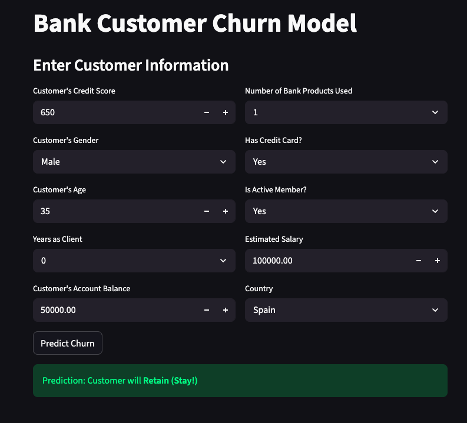

# Bank-Churn-Model

This project is a machine learning application that predicts whether a bank customer is likely to churn (leave the bank) based on their profile and transaction history. It uses a Random Forest Classifier for accurate and interpretable predictions and is deployed as a Streamlit web app for interactive use.

**🔍Project Overview**
Model: Random Forest Classifier

Deployment: Streamlit Web App

Goal: Predict customer churn to assist banks in retention strategy

Input: Customer attributes (e.g., credit score, tenure, balance, etc.)

Output: Churn prediction

**🎯 Features**
User-friendly interface to input customer details

Instant churn prediction with confidence level

Data preprocessing (encoding, scaling) included in the pipeline

**Clean visual layout with Streamlit**

https://abayomibello-data-bank-churn-model-stream-app-evlrax.streamlit.app/

